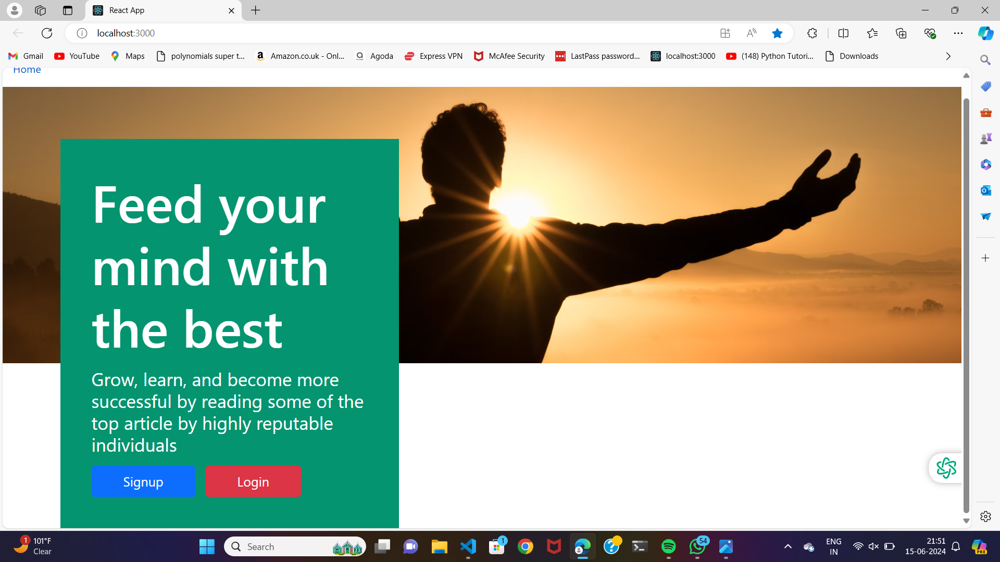
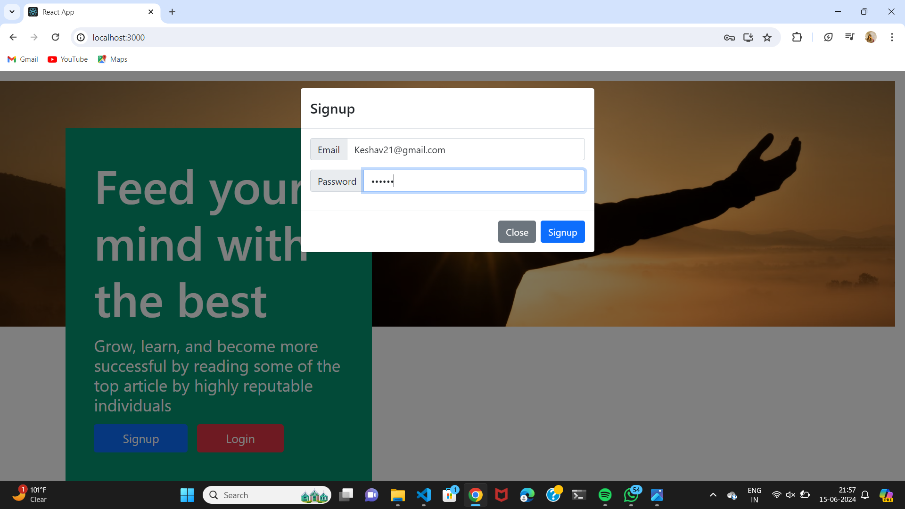
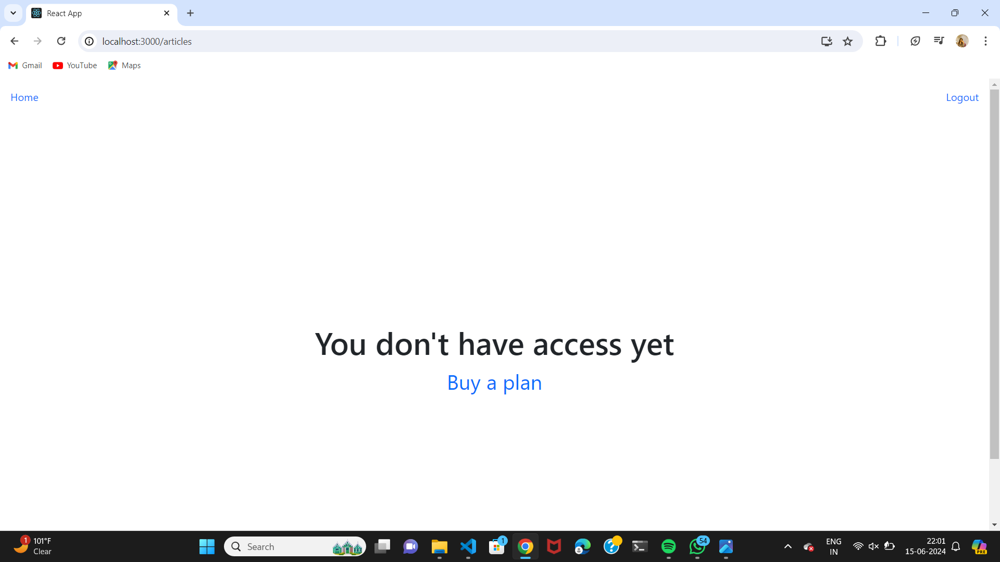
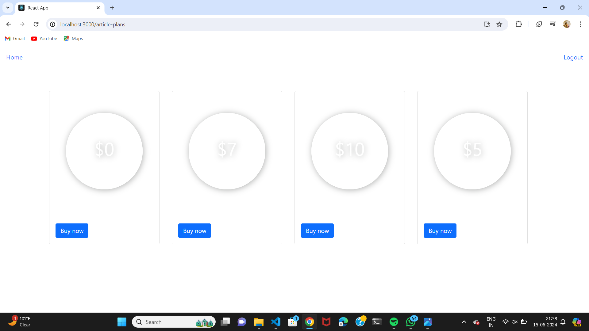
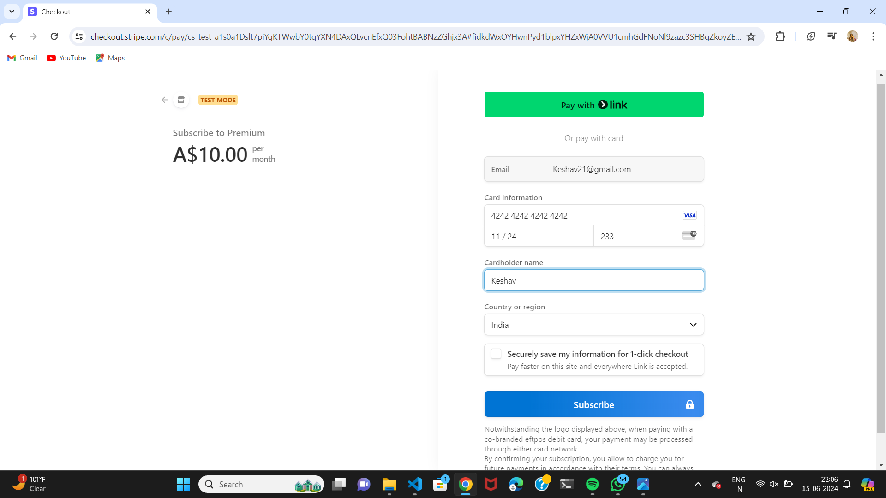
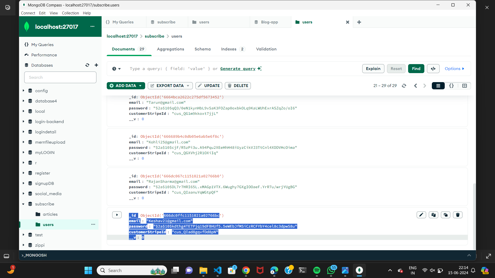

# Subscription-App
<h2>Home Page</h2>
 

<h2>Signup</h2>

<h2>Article page</h2>

Click on Buy now to buy a subscription

<h2>Plans Page</h2>

 <h2>Bougth Premium plan</h2>
 
 <h2>Stripe dashboard</h2>
 
<h2>Database</h2>

